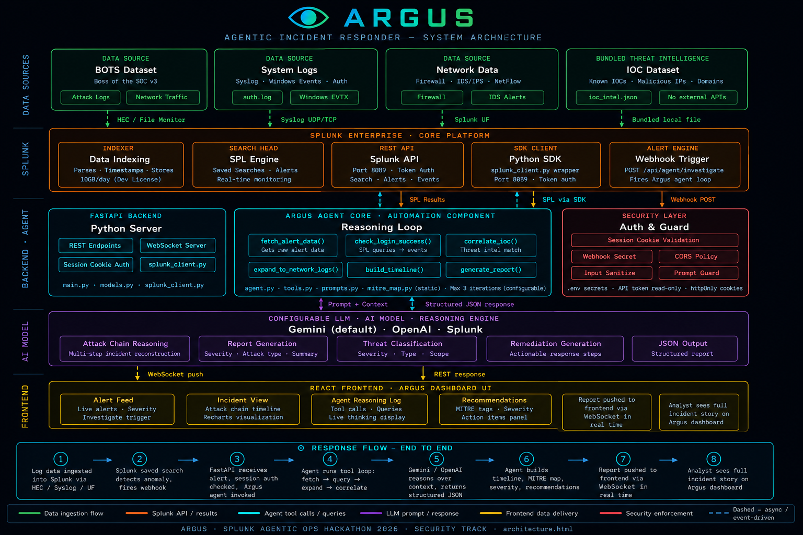

# Argus — Agentic Incident Responder

> *The all-seeing SOC agent. Alert in. Incident story out.*

Argus is an agentic security incident responder built for the **Splunk Agentic Ops Hackathon 2026**. When Splunk fires an alert, Argus autonomously investigates it using an LLM-driven reasoning loop and delivers a complete incident report — attack chain timeline, MITRE ATT&CK mapping, IOC correlation, and specific remediation steps — in seconds.



---

## What Argus Does

A SOC analyst receives dozens of Splunk alerts daily. For each one they must manually dig through thousands of log lines, correlate events across systems, reconstruct what happened, determine severity, map to MITRE ATT&CK, and write up findings. That takes hours per incident.

Argus solves this. It takes a fired Splunk alert, runs a dynamic LLM-driven investigation, and delivers a complete incident report. What used to take two hours takes seconds.

### Key Capabilities

- **Autonomous investigation** — the LLM decides what to investigate next based on evidence, not a fixed script
- **Dynamic SPL generation** — for unknown alert types, the agent discovers available sourcetypes and writes its own Splunk queries at runtime
- **Attack chain reconstruction** — chronological timeline of the full kill chain
- **MITRE ATT&CK mapping** — deterministic keyword-based classification across 40+ techniques
- **IOC correlation** — checks extracted IPs and domains against a bundled threat intel dataset
- **Real-time streaming** — every agent decision streams live to the UI via WebSocket
- **Exportable reports** — one-click PDF export with full incident details
- **Browser notifications** — push notification when a CRITICAL or HIGH investigation completes
- **Splunk-native** — triggered directly by Splunk saved search alerts via webhook

---

## How the Agent Works

This is the critical design decision that makes Argus genuinely agentic rather than a disguised script.

At each iteration the LLM receives the current investigation state, the history of actions already taken, and a list of available actions. It then chooses what to do next and explains why. The agent executes that action, updates the state, and the loop repeats.

```
Alert fires
    │
    ▼
fetch_alert_data          ← always runs first
    │
    ▼
discover_schema           ← queries available sourcetypes; injected into planner context
    │
    ▼
LLM chooses next action   ← based on what was found
    │
    ├── check_login_success
    ├── check_process_execution
    ├── expand_to_network_logs
    ├── check_lateral_movement
    ├── check_outbound_connections
    ├── check_cryptomining
    ├── correlate_ioc
    ├── run_spl               ← LLM writes its own SPL for unknown alert types
    └── build_timeline → generate_report
```

The LLM drives the investigation path. Different alert types produce different investigation sequences. For alert types that don't match a specific tool, the agent uses `run_spl` — it discovers what sourcetypes exist in the environment and writes a targeted SPL query itself. The reasoning log — visible in the UI in real time — shows every decision the agent makes and why.

---

## Tech Stack

| Component | Technology |
|---|---|
| Data platform | Splunk Enterprise |
| Backend | Python 3.12, FastAPI, uvicorn |
| Agent orchestration | Custom LLM planner loop |
| LLM (primary) | Google Gemini 3.1 Flash Lite |
| LLM (fallback) | OpenAI GPT-4o-mini |
| Splunk integration | Splunk Python SDK |
| Alert trigger | Splunk Webhook → FastAPI |
| Real-time stream | WebSockets |
| Frontend | React + Vite + Tailwind CSS |
| Charts | Recharts |
| PDF export | jsPDF |
| MITRE mapping | Static keyword dict (40+ techniques) |
| Threat intel | Bundled IOC JSON (no external APIs) |
| Auth | Session cookie |
| Demo dataset | BOTS v3 (Boss of the SOC) |

---

## Project Structure

```
argus/
├── backend/
│   ├── main.py              # FastAPI app, WebSocket, session auth, endpoints
│   ├── agent.py             # LLM-driven planner loop — the core of the project
│   ├── splunk_client.py     # Splunk Python SDK wrapper (read-only)
│   ├── tools.py             # Agent tool implementations (specific + dynamic SPL)
│   ├── prompts.py           # Planner prompt + report generator prompt
│   ├── models.py            # Pydantic models
│   ├── llm_provider.py      # Abstract LLMProvider + Gemini/OpenAI implementations
│   ├── mitre_map.py         # Static keyword → MITRE T-code mapping
│   ├── ioc_intel.json       # Bundled threat intel dataset
│   └── requirements.txt
│
├── frontend/
│   ├── src/
│   │   ├── components/
│   │   │   ├── AgentLog.jsx          # Live reasoning stream
│   │   │   ├── AttackTimeline.jsx    # Recharts attack chain timeline
│   │   │   ├── AlertFeed.jsx         # Incoming alerts list
│   │   │   ├── RecommendationsPanel.jsx
│   │   │   ├── IncidentView.jsx      # Full incident report view + PDF export
│   │   │   ├── SeverityBadge.jsx
│   │   │   └── MitreTag.jsx
│   │   ├── hooks/
│   │   │   ├── useWebSocket.js
│   │   │   └── useSession.js
│   │   ├── api/argus.js
│   │   └── App.jsx
│   ├── .env
│   └── .env.example
│
├── splunk/configs/
│   ├── savedsearches.conf   # Splunk saved search definitions
│   └── alert_actions.conf
│
├── architecture.html        # Interactive architecture diagram
├── architecture.png         # Architecture diagram (repo root, required)
├── README.md
└── LICENSE                  # MIT
```

---

## Setup

### Prerequisites

- Python 3.12+
- Node.js 18+
- Splunk Enterprise
- BOTS v3 dataset loaded into Splunk
- Google Gemini API key **or** OpenAI API key

### 1. Clone the repo

```bash
git clone https://github.com/Mosope-ade/argus.git
cd argus
```

### 2. Backend setup

```bash
cd backend
python3 -m venv ../.venv
source ../.venv/bin/activate
pip install -r requirements.txt
```

Create `backend/.env`:

```env
# Splunk
SPLUNK_HOST=localhost
SPLUNK_PORT=8089
SPLUNK_TOKEN=your-splunk-api-token
SPLUNK_INDEX=botsv3

# LLM — set one provider
LLM_PROVIDER=gemini
GEMINI_API_KEY=your-gemini-api-key
GEMINI_MODEL=your-gemini-model

# OpenAI fallback (optional)
OPENAI_API_KEY=
OPENAI_MODEL=gpt-4o-mini

# App
PASSWORD=your-chosen-password   # required — server refuses to start if not set
WEBHOOK_SECRET=your-webhook-secret   # required for production; omit only in local dev (a warning will be logged)
BACKEND_PORT=8001
CORS_ORIGIN=http://localhost:5173
MAX_AGENT_ITERATIONS=3
```

Start the backend:

```bash
uvicorn main:app --reload --port 8001
```

### 3. Frontend setup

```bash
cd frontend
npm install
```

Create `frontend/.env` (or copy from `.env.example`):

```env
VITE_API_URL=http://localhost:8001
VITE_WS_URL=ws://localhost:8001
```

Start the frontend:

```bash
npm run dev
```

Open http://localhost:5173 and log in with the password set in `PASSWORD`. The server will refuse to start if `PASSWORD` is not set.

### 4. Splunk configuration

#### Generate a Splunk API token

In Splunk Web: Settings → Tokens → New Token. Copy the token into `SPLUNK_TOKEN` in your `.env`.

#### Load BOTS v3

Download the BOTS v3 dataset from https://github.com/splunk/botsv3 and install it as a Splunk app. The data indexes as `botsv3`.

#### Create saved search alerts

In Splunk Web → Search & Reporting, run this query and save it as an alert:

**SSH Brute Force Detected**
```spl
index=botsv3 sourcetype=linux_secure _raw="*Invalid user*" earliest=0
| stats count by host
| where count > 5
| head 1
```

Alert settings:
- Schedule: `Run on Cron Schedule` → `* * * * *`
- Time Range: `All time`
- Trigger: `Number of Results is greater than 0` → `Once`
- Throttle: 60 minutes (prevents alert spam)
- Action: `Webhook` → `http://localhost:8001/api/agent/investigate`

**Suspicious Outbound Connection**
```spl
index=botsv3 sourcetype=stream:tcp _raw="*91.207.175.249*" earliest=0
| stats count by src_ip
| where count > 0
| head 1
```

Same alert settings, same webhook URL.

**Cryptomining Activity Detected**
```spl
index=botsv3 sourcetype="stream:dns" coinhive earliest=0
| stats count by host
| where count > 0
| head 1
```

Same alert settings, same webhook URL.

#### Test the webhook manually

Without `WEBHOOK_SECRET` set (local dev only):
```bash
# SSH Brute Force
curl -X POST http://localhost:8001/api/agent/investigate \
  -H "Content-Type: application/json" \
  -d '{
    "sid": "test-001",
    "search_name": "SSH Brute Force Detected",
    "result_count": 1,
    "result": {
      "src_ip": "5.101.40.81",
      "host": "gacrux.i-0920036c8ca91e501"
    }
  }'

# Suspicious Outbound Connection
curl -X POST http://localhost:8001/api/agent/investigate \
  -H "Content-Type: application/json" \
  -d '{
    "sid": "test-002",
    "search_name": "Suspicious Outbound Connection",
    "result_count": 1,
    "result": {
      "src_ip": "91.207.175.249",
      "host": "gacrux.i-0920036c8ca91e501"
    }
  }'

# Cryptomining Activity Detected
curl -X POST http://localhost:8001/api/agent/investigate \
  -H "Content-Type: application/json" \
  -d '{
    "sid": "test-003",
    "search_name": "Cryptomining Activity Detected",
    "result_count": 1,
    "result": {
      "host": "mercury.i-0920036c8ca91e501"
    }
  }'
```

With `WEBHOOK_SECRET` set:
```bash
curl -X POST http://localhost:8001/api/agent/investigate \
  -H "Content-Type: application/json" \
  -H "Authorization: Bearer your-webhook-secret" \
  -d '{
    "sid": "test-001",
    "search_name": "SSH Brute Force Detected",
    "result_count": 1,
    "result": {
      "src_ip": "5.101.40.81",
      "host": "gacrux.i-0920036c8ca91e501"
    }
  }'

# Suspicious Outbound Connection
curl -X POST http://localhost:8001/api/agent/investigate \
  -H "Content-Type: application/json" \
  -H "Authorization: Bearer your-webhook-secret" \
  -d '{
    "sid": "test-002",
    "search_name": "Suspicious Outbound Connection",
    "result_count": 1,
    "result": {
      "src_ip": "91.207.175.249",
      "host": "gacrux.i-0920036c8ca91e501"
    }
  }'

# Cryptomining Activity Detected
curl -X POST http://localhost:8001/api/agent/investigate \
  -H "Content-Type: application/json" \
  -H "Authorization: Bearer your-webhook-secret" \
  -d '{
    "sid": "test-003",
    "search_name": "Cryptomining Activity Detected",
    "result_count": 1,
    "result": {
      "host": "mercury.i-0920036c8ca91e501"
    }
  }'
```

#### Testing dynamic SPL with unknown alert types

For alert types Argus doesn't have a dedicated tool for, the agent discovers available sourcetypes and writes its own SPL. Any `search_name` that doesn't match a known pattern triggers this path:

```bash
# Windows authentication failures (WinEventLog)
curl -X POST http://localhost:8001/api/agent/investigate \
  -H "Content-Type: application/json" \
  -H "Authorization: Bearer argus" \
  -d '{
    "search_name": "Windows Authentication Failure Spike",
    "sid": "test-win-001",
    "result_count": 1,
    "result": {
      "host": "hildegard",
      "src_ip": "192.168.250.100"
    }
  }'

# Web application attack (stream:http)
curl -X POST http://localhost:8001/api/agent/investigate \
  -H "Content-Type: application/json" \
  -H "Authorization: Bearer argus" \
  -d '{
    "search_name": "Suspicious Web Request Detected",
    "sid": "test-web-001",
    "result_count": 1,
    "result": {
      "host": "brewertalk",
      "src_ip": "45.77.65.211"
    }
  }'
```

Argus will query the available sourcetypes, write a targeted SPL based on the alert context, investigate, and produce a full incident report.

---

## Environment Variables

### Backend (`backend/.env`)

| Variable | Default | Description |
|---|---|---|
| `SPLUNK_HOST` | `localhost` | Splunk host |
| `SPLUNK_PORT` | `8089` | Splunk REST API port |
| `SPLUNK_TOKEN` | — | Splunk API token (required) |
| `SPLUNK_INDEX` | `botsv3` | Splunk index to query |
| `SPLUNK_VERIFY_TLS` | `true` | Verify Splunk TLS certificate; set `false` for local dev with self-signed cert |
| `SPL_TIME_WINDOW` | `0` | Default `earliest=` bound for dynamic SPL queries (`0` = all time; use `-24h` etc. for live deployments) |
| `LLM_PROVIDER` | `gemini` | LLM provider: `gemini` or `openai` |
| `GEMINI_API_KEY` | — | Google Gemini API key |
| `GEMINI_MODEL` | `gemini-2.0-flash` | Gemini model name |
| `OPENAI_API_KEY` | — | OpenAI API key (fallback) |
| `OPENAI_MODEL` | `gpt-4o-mini` | OpenAI model name |
| `PASSWORD` | — | UI login password — **required**, server refuses to start if missing |
| `WEBHOOK_SECRET` | — | Bearer token Splunk must send to `/api/agent/investigate`; omit only in local dev |
| `SECURE_COOKIES` | `false` | Set to `true` in production (requires HTTPS) |
| `BACKEND_PORT` | `8001` | FastAPI port |
| `CORS_ORIGIN` | `http://localhost:5173` | Frontend origin for CORS |
| `MAX_AGENT_ITERATIONS` | `3` | Maximum planner iterations per investigation |
| `MAX_PENDING_ALERTS` | `500` | Cap on in-memory alert queue — oldest evicted when exceeded |
| `MAX_INCIDENTS` | `1000` | Cap on in-memory incident store — oldest evicted when exceeded |

### Frontend (`frontend/.env`)

| Variable | Default | Description |
|---|---|---|
| `VITE_API_URL` | `http://localhost:8001` | Backend API base URL |
| `VITE_WS_URL` | `ws://localhost:8001` | WebSocket base URL |

---

## API Reference

All endpoints except `POST /api/login` require a valid session cookie. The WebSocket endpoint requires the session cookie on the initial upgrade request.

| Method | Endpoint | Auth | Description |
|---|---|---|---|
| `POST` | `/api/login` | — | Authenticate |
| `POST` | `/api/logout` | cookie | End session |
| `GET` | `/api/health` | cookie | Health check |
| `POST` | `/api/agent/investigate` | `WEBHOOK_SECRET` | Splunk webhook target |
| `POST` | `/api/agent/reinvestigate/{id}` | cookie | Re-run agent on existing alert |
| `GET` | `/api/alerts` | cookie | List all received alerts |
| `DELETE` | `/api/alerts/{id}` | cookie | Delete an alert |
| `GET` | `/api/incidents` | cookie | List all completed incident reports |
| `GET` | `/api/incidents/{id}` | cookie | Get a single incident report |
| `WS` | `/ws/incidents` | cookie | Real-time agent step stream |

### WebSocket message types

| Type | Direction | Payload |
|---|---|---|
| `ping` | server → client | Connection confirmed |
| `new_alert` | server → client | `{alert: {...}}` |
| `plan` | server → client | `{action, reasoning, iteration, alert_id}` |
| `result` | server → client | `{action, summary, data, alert_id}` |
| `done` | server → client | `{incident_id, alert_id, report: {...}}` |
| `error` | server → client | `{message}` |

---

## Agent Tools

| Tool | When it runs | Description |
|---|---|---|
| `fetch_alert_data` | Always — step 0 | Fetches raw alert events from Splunk |
| `discover_schema` | Always — step 0.5 | Queries available sourcetypes; result is injected into the planner context |
| `run_spl` | LLM choice | LLM writes its own SPL query for unknown alert types — write/export commands are rejected before dispatch |
| `check_login_success` | LLM choice | Queries for successful logins from the attacker IP |
| `expand_to_network_logs` | LLM choice | Pulls network events for involved hosts |
| `check_process_execution` | LLM choice | Looks for command execution after initial access |
| `check_lateral_movement` | LLM choice | Checks for movement between internal hosts |
| `check_cryptomining` | LLM choice | Detects cryptomining DNS lookups for known mining pool domains |
| `correlate_ioc` | LLM choice | Checks all IPs/domains seen in findings against the bundled IOC dataset |
| `check_outbound_connections` | LLM choice | Looks for suspicious outbound traffic and C2 indicators |
| `build_timeline` | Always — before report | Sorts all findings chronologically and applies MITRE mapping |

All tools are **read-only**. Dynamic SPL queries generated by `run_spl` are sanitised to reject any write or export commands before execution.

---

## MITRE ATT&CK Coverage

Argus maps log events to 40+ MITRE ATT&CK techniques across these tactics:

- Credential Access (T1110, T1078, T1003)
- Discovery (T1033, T1016, T1049, T1046, T1082, T1083, T1057, T1087, T1018)
- Lateral Movement (T1021.004)
- Execution (T1059, T1059.004, T1059.006)
- Command and Control (T1071, T1105)
- Defense Evasion (T1027, T1222, T1070)
- Persistence (T1053.003, T1136, T1098, T1543, T1037)
- Privilege Escalation (T1548)
- Exfiltration (T1041)

Mapping is deterministic keyword-based — no LLM call needed, instant, reliable.

---

## Demo Scenario

The primary demo scenario uses the BOTS v3 dataset:

**SSH Brute Force → Unauthorized Access → Reconnaissance → C2**

1. Splunk detects SSH brute force from `5.101.40.81` against `gacrux.i-0920036c8ca91e501`
2. Alert fires → Argus receives webhook
3. Agent fetches 12 brute force events
4. Agent correlates `5.101.40.81` → IOC match (HIGH confidence)
5. Agent checks for successful logins → finds `ec2-user` logged in from `91.207.175.249`
6. Agent checks process execution → finds 30 command events (recon activity)
7. Timeline built → report generated
8. Full incident report delivered in under 20 seconds

---

## Security Notes

- All Splunk queries are **read-only** — Argus has no write access to Splunk
- Both the planner and reporter prompts include explicit injection guards — log content is treated as data only, not instructions
- IP addresses are validated with RFC-compliant regex before insertion into SPL queries
- Splunk credentials are stored in `.env` and gitignored
- The `.gitignore` explicitly excludes `.env`, `*.env`, and `__pycache__`
- Session cookies are `httponly` and `samesite=strict`; sessions expire after 24 hours
- Login is rate-limited to 5 failed attempts per 5-minute window per IP
- The WebSocket endpoint requires a valid session — unauthenticated connections are rejected before the handshake completes
- Webhook body logging captures only safe summary fields; raw log content is never written to the application log

For production deployment: set `SECURE_COOKIES=true` (requires HTTPS), set `WEBHOOK_SECRET`, and deploy behind a reverse proxy with TLS termination.

---

## License

MIT — see [LICENSE](LICENSE).

---

*Built for the Splunk Agentic Ops Hackathon 2026 · Security Track*
*Author: Adeyinka Adejumo (AdeyLord) · GitHub: [@Mosope-ade](https://github.com/Mosope-ade)*
